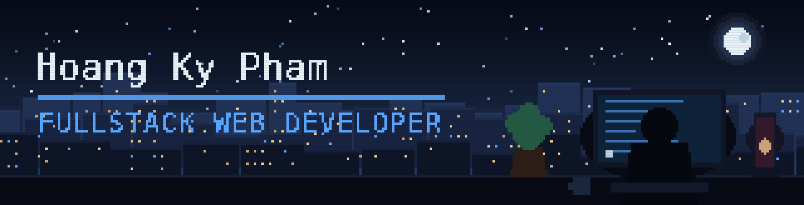

<p align="center">
  
</p>

<h1 align="center">Hi, I'm Hoang Ky Pham 👋</h1>

<p align="center">
  <a href="https://github.com/hk1682">
    
  </a>
</p>

<p align="center">
  
  
  
</p>


## 👨‍💻 About Me

```yaml
role:      Frontend / Fullstack Web Developer
stack:     [ TypeScript, React, Next.js, Tailwind CSS, Node.js ]
also:      [ GraphQL, Python automation, PostgreSQL, MongoDB ]
building:  [ restaurant QR ordering platform, language-learning SaaS ]
status:    Open to web developer opportunities
mindset:   "Proof of work over opinions."
```

- 🎯 Frontend-leaning fullstack developer — I build complete products end to end, not isolated UI pieces
- ⚛️ Daily driver: **TypeScript + React + Next.js**, styled with **Tailwind CSS** and **shadcn/ui**
- 🔌 Comfortable across the stack: REST and **GraphQL** APIs, auth, payments, realtime sockets
- 🤖 Side interest in **Python automation** and AI-assisted tooling
- 📈 Exploring where web engineering meets **finance and trading systems**
- 🌱 Currently sharpening system design and testing practices


## 🛠️ Tech Stack

<table align="center">
  <tr>
    <td align="center"><b>Languages</b></td>
    <td></td>
  </tr>
  <tr>
    <td align="center"><b>Frontend</b></td>
    <td></td>
  </tr>
  <tr>
    <td align="center"><b>Backend &amp; Database</b></td>
    <td></td>
  </tr>
  <tr>
    <td align="center"><b>Tooling</b></td>
    <td></td>
  </tr>
</table>

<p align="center">
  
  
  
  
  
  
  
  
  
</p>


## 🚀 Featured Projects

<table>
  <tr>
    <td width="50%" valign="top">
      <a href="https://github.com/hk1682/DeBistro-Restaurant-Management-QR-Ordering-System">
        
      </a>
      <p><sub>🍽️ <b>Restaurant management &amp; QR ordering platform.</b> Guests scan a table QR and order without an app; staff track orders live. Next.js App Router, TanStack Query &amp; Table, Socket.io realtime, JWT auth, QR generation, shadcn/ui.</sub></p>
      <p>
        
        
        
      </p>
    </td>
    <td width="50%" valign="top">
      <a href="https://github.com/hk1682/lingdo-languages">
        
      </a>
      <p><sub>🗣️ <b>Gamified language-learning SaaS.</b> Lessons, progress tracking and hearts system with a full subscription flow — Next.js, Drizzle ORM on Neon Postgres, Clerk auth, Stripe billing, react-admin dashboard.</sub></p>
      <p>
        
        
        
      </p>
    </td>
  </tr>
  <tr>
    <td width="50%" valign="top">
      <a href="https://github.com/hk1682/pokedex---graphQL">
        
      </a>
      <p><sub>🔍 <b>GraphQL-powered Pokédex.</b> Typed queries with Apollo Client, server-side routing on React Router v7, Tailwind + shadcn UI, containerized with Docker.</sub></p>
      <p>
        
        
        
      </p>
    </td>
    <td width="50%" valign="top">
      <h4>🧰 Also in the toolbox</h4>
      <ul>
        <li><a href="https://github.com/hk1682/furniro"><b>furniro</b></a> — Express + MongoDB REST API with JWT auth and Joi validation</li>
        <li><a href="https://github.com/hk1682/beginner-angular"><b>beginner-angular</b></a> — Angular SSR app exploring a second framework</li>
        <li><a href="https://github.com/hk1682/booking_movie_tickets_online"><b>booking_movie_tickets_online</b></a> — PHP cinema booking system</li>
        <li><a href="https://github.com/hk1682/kana-shop"><b>kana-shop</b></a> — static storefront build</li>
      </ul>
      <p><sub>Plus private work on Python trading automation and Shopify/Hydrogen storefronts.</sub></p>
    </td>
  </tr>
</table>


## 📊 GitHub Stats

<p align="center">
  
  
</p>

<p align="center">
  
</p>

<p align="center">
  
  
</p>

<p align="center">
  
  
</p>

<h3 align="center">🐍 Contribution Snake</h3>

<p align="center">
  <picture>
    <source media="(prefers-color-scheme: dark)" srcset="https://raw.githubusercontent.com/hk1682/hk1682/output/github-snake-dark.svg">
    <source media="(prefers-color-scheme: light)" srcset="https://raw.githubusercontent.com/hk1682/hk1682/output/github-snake.svg">
    
  </picture>
</p>


## 📫 Connect

<p align="center">
  <a href="https://www.linkedin.com/in/hoangkypham">
    
  </a>
  <a href="https://github.com/hk1682">
    
  </a>
  <a href="https://github.com/hk1682?tab=repositories">
    
  </a>
</p>

<p align="center">
  
</p>

<p align="center">
  <sub>⭐ Thanks for stopping by — feel free to look around the repos.</sub>
</p>
